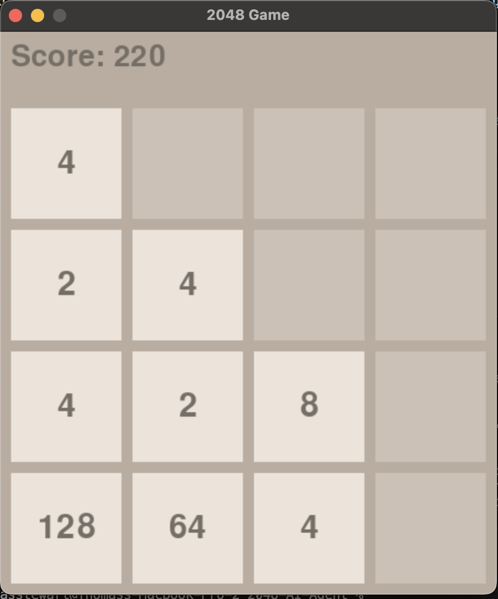

# **2048 Game**

An implementation of the classic **2048 game** with a focus on clean design and intuitive gameplay. This project allows users to play the game manually, showcasing smooth tile movements, score tracking, and game-over detection. It was built entirely in Python and uses **Pygame** for rendering.

This repository serves as the foundation for the AI-enhanced version of the game, which can be explored in detail in the [2048 AI Project](https://github.com/T-Stewart25/2048-AI-Project) repository.

---

## **Key Features**

- **Smooth Gameplay**: Tiles slide and merge seamlessly, recreating the authentic 2048 experience.
- **Score Tracking**: Displays the current score and updates dynamically with each move.
- **Game-Over Detection**: Automatically detects when no valid moves are left.
- **Modern Interface**: Simple yet visually appealing design powered by **Pygame**.

---

## **Table of Contents**

- [Features](#key-features)
- [Demo](#demo)
- [Installation](#installation)
- [Usage](#usage)
  - [Playing the Game](#playing-the-game)
- [Project Structure](#project-structure)
- [Contributing](#contributing)
- [License](#license)
- [Contact](#contact)

---

## **Demo**



*Caption: Demonstraiton of game visual mid game*

---

## **Installation**

### **Prerequisites**
- Python 3.7 or higher
- [Pip](https://pip.pypa.io/en/stable/) package manager

### **Setup Instructions**

1. **Clone the Repository**
   ```bash
   git clone https://github.com/T-Stewart25/2048-Game.git
   cd 2048-Game
   ```

2. **Install Dependencies**
   ```bash
   pip install -r requirements.txt
   ```

3. **Run the Game**
   ```bash
   python main.py
   ```

---

## **Usage**

### **Playing the Game**
- Launch the game using the command above.
- Use the arrow keys to move tiles in the desired direction:
  - **Up**: Move tiles upward.
  - **Down**: Move tiles downward.
  - **Left**: Move tiles to the left.
  - **Right**: Move tiles to the right.
- Aim to merge tiles and reach the 2048 tile.
- The game ends when no moves are left.

---

## **Project Structure**

```
2048-Game/
├── tiles.py            # Handles tile creation and movement
├── setup.py            # Pygame setup and rendering logic
├── environment.py      # Game logic and state management
├── main.py             # Main entry point for the game
├── README.md           # Project documentation
├── requirements.txt    # Python dependencies
└── LICENSE             # License information
```

---

## **Contributing**

Contributions are welcome! Here's how you can get involved:
1. Fork the repository.
2. Create a feature branch:
   ```bash
   git checkout -b feature/your-feature-name
   ```
3. Commit your changes:
   ```bash
   git commit -m "Add your feature description"
   ```
4. Push to your branch:
   ```bash
   git push origin feature/your-feature-name
   ```
5. Submit a pull request for review.

---

## **License**

This project is licensed under the [MIT License](LICENSE). Feel free to use, modify, and distribute this project under the terms of the license.

---

## **Contact**

- **Author**: Thomas Stewart
- **Email**: thomaslstewart1@gmail.com
- **GitHub**: [T-Stewart25](https://github.com/T-Stewart25)
- **Personal Portfolio**: [Portfolio](https://thomasstewartpersonal.com)
